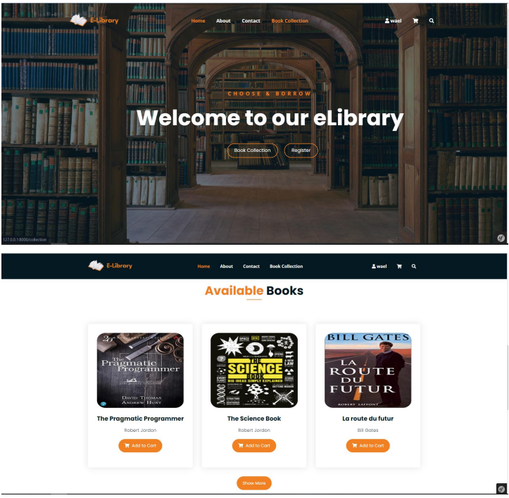
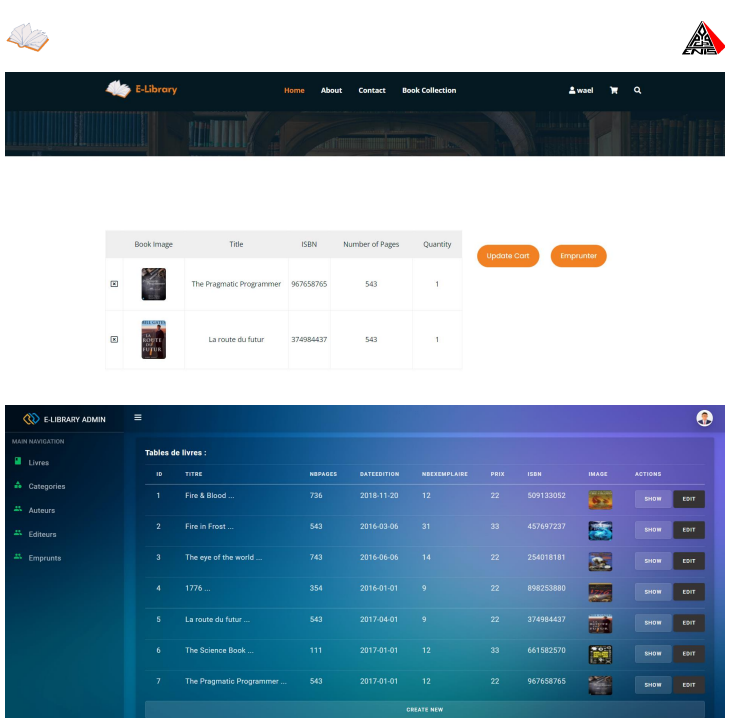
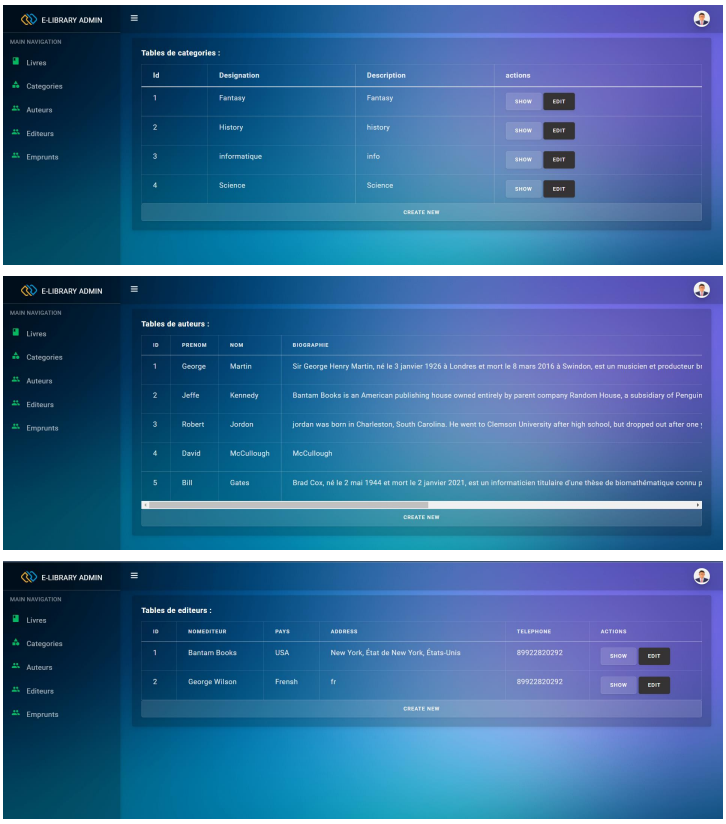

Welcome to our comprehensive E-Library Management Web Application developed with Symfony 7, PHP, Bootstrap, HTML, and CSS!

**Features:**
- Admin Dashboard: Manage book borrowing requests with ease, including approval and disapproval functionalities.
- Backoffice Book Management: Add, edit, and manage books seamlessly from the admin panel.
- Responsive Frontend: Enjoy a visually appealing and user-friendly frontend design for easy navigation and usage.
- Multirole Authentication: Ensure secure access with multirole authentication, allowing different levels of access for administrators and users.
  
**Technologies Used:**
- Symfony 7: Powerful PHP framework for building robust web applications.
- PHP: Server-side scripting language for dynamic web development.
- Bootstrap: Frontend framework for responsive and mobile-first design.
- HTML & CSS: Core technologies for building structured web pages and styling them.
  
Feel free to explore our application and experience efficient book management in action!

**Screen shots**

